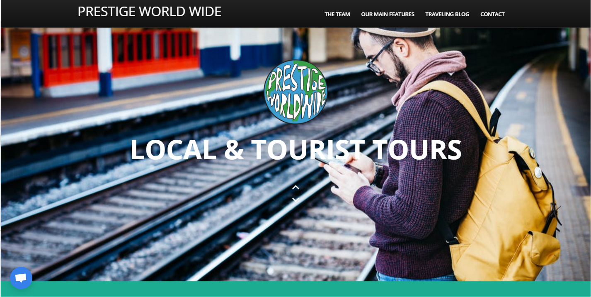

# Prestige-World-Wide
Landing page for Prestige World Wide Travel Application. Prestige World Wide is a tourism and travel application to provide resources all in on place. 

In addition to access to travel blog and trip information, users can also view recommendations tailored to provide tourist and local attractions for visits to major cities. 

Users also have the option to request new cities be added for future enhancements.

For Deployed Project <a href="https://prestige-world-wide-3.herokuapp.com/"> Click Here</a>

Prestige World Wide is an all-in-one travel application using React, Mongo DB, Axios, and several other 
</img> 

<h4>Tech Stack:</h4>
Front End: HTML, CSS, JavaScript, jQuery, React JS, Twitter Bootstrap, Bootswatch

Back End & User Login: Mongo DB, Axios, Passport, Google Login Auth, Google Places API

<h4>Comments:</h4>
This project is part of a group collaboration containing additional repositories. For views of all applicable repositories see links below:

HomePage: <a href="https://github.com/kvillejoint/Prestige-World-Wide-3"> Click Here</a>
Login & Credential Authorization: <a href="https://github.com/cemolo/Prestige_Exp_Auth"> Click Here</a>
Tourist Recommendations (powered by React JS): <a href="https://github.com/arfusop/prestige-world-wide"> Click Here</a>

<h4>Notes:</h4>
1. For viewing application on Google Chrome (recommended), please install CORS Toggle add-on. Add-on can be found by <a href="https://chrome.google.com/webstore/detail/cors-toggle/omcncfnpmcabckcddookmnajignpffnh?hl=en">clicking here</a>.